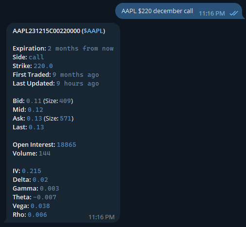

Symbols are used in headings to denote what platforms and symbol types a command supports.

- Telegram Only :fontawesome-brands-telegram:
- Discord Only :fontawesome-brands-discord:
- Bot Commands :robot:
- Cryptocurrency Support :material-currency-btc:
- Stock Market Support :bank:

## Get the Bots

[:fontawesome-brands-telegram: Telegram](https://t.me/SimpleStockBot){ .md-button } [:fontawesome-brands-discord: Discord](https://discordapp.com/api/oauth2/authorize?client_id=532045200823025666&permissions=36507338752&scope=bot){ .md-button }

## Symbol Detection :material-currency-btc: :bank:

The Simple Stock Bot looks at every message it can see and tries to detect stock and cryptocurrency symbols. Stock market tickers are denoted with a single `$` and cryptocurrency coins are denoted with a double `$$`. So getting the price of Tesla is as simple as `$tsla` and Bitcoin `$$btc`. These symbols can be in any part of a message and there can be multiple of them aswell.

    

        

            I wonder how $tsla is affecting the price of $$btc
        

        

        The current stock price of Tesla Inc is $866.57, the stock is currently up 1.68%
        

        

        The current price of Bitcoin is $34,815, the coin is currently down -0.151% for today
        

    

## Options Detection :bank:

This command allows you to query real-time data for stock options. By simply inputting the stock symbol, strike price, month, and specifying either a call or a put, you can get the latest options data right at your fingertips. For example, `AAPL $220 December call` will provide the current data for Apple's call option with a $220 strike price expiring in December.

## `/donate [Amount in USD]` :fontawesome-brands-telegram-plane:

The donate command is used to send money to the bot to help keep it free. The premium stock market data and server rentals add up so any amount helps. See the [Donate](donate.md) page for more information.

    

        

            /donate
        

        

            The current stock price of Tesla Inc is $664.315, the stock is
            currently down -0.99%
        

    

## `/intra [symbol]` :bank: :material-currency-btc:

This command makes a chart of a stocks movement since the last market open, or the last 24 hours for cryptocurrency.

    

        

            /intra $astr
        

        

          
          
Intraday chart for $ASTR from 06 Jul at 09:30 to 06 Jul at 15:59

          
The current stock price of Astra Space Inc - Class A is $12.47, the stock is currently down -19.39%

        

    

## `/chart [symbol]` :bank: :material-currency-btc:

This command makes a chart of the last 1 month of trading data up until the day before. For example running it on May 5th creates a chart from April 5th to May 4th.

    

        

            /intra $astr
        

        

          
          
1 Month chart for Ethereum from 07, Jun 2021 to 07, Jul 2021

          
The current price of Ethereum is $2,389.62, the coin is currently up 2.485% for today

        

    

## `/trending`

Gets the latest trending stocks and their change in price

    

        

            /trending
        

        <pre class="message from">

🦍Trending on the Stock Bot:
━━━━━━━━━━━━━━━━━━━━━━━━━━
$GME: Gamestop Corporation - Class A, 5.06%
$MMAT: Meta Materials Inc, 4.77%

$$
BTC: Bitcoin, -0.83%
$$ETH: Ethereum, 6.06%
$$DOGE: Binance-Peg Dogecoin, 0.14%

💵Trending Stocks:
━━━━━━━━━━━━━━━━
$BBIG: Vinco Ventures Inc, 15.44%
$GSAT: Globalstar Inc., -15.32%
$AMC: AMC Entertainment Holdings Inc - Class A, 8.77%
$ACIU: AC Immune SA, 16.31%
$PLTR: Palantir Technologies Inc - Class A, 2.25%
$AAPL: Apple Inc, -0.84%
$XELA: Exela Technologies Inc, 12.61%
$WFC: Wells Fargo & Co., -5.60%
$BAC: Bank Of America Corp., 0.22%
$AMD: Advanced Micro Devices Inc., -0.54%

🦎Trending Crypto:
━━━━━━━━━━━━━━━━
$$NFD: Feisty Doge NFT, -34.32%
$$SLP: Smooth Love Potion, -13.02%
$$PVU: Plant vs Undead Token, -1.27%
$$XED: Exeedme, 1.02%
$$SOL: Solana, -3.95%
$$BNB: Binance Coin, -0.25%
$$EWT: Energy Web Token, 17.72%

        </pre>
    

## /help :robot:

Just a simple command to get help in app. Returns a more summarized version of this page.

    

        

            /help
        

        

            The current stock price of Tesla Inc is $664.315, the stock is
            currently down -0.99%
        

    

## `/status` :robot:

This command is to get diagnostic information about the bot and the services it is dependant on in order to operate. Any issues should be reported to me. [Contact](contact.md)

    

        

            /status
        

        <pre class="message from">
Bot Status:
        It took 0.783369 seconds for the bot to get your message.

        Stock Market Data:
        marketdata.app is currently not reporting any issues with its API.

        Cryptocurrency Data:
        CoinGecko API responded that it was OK in 0.160962 Seconds.
        </pre>
    

## Inline Features :fontawesome-brands-telegram: :material-currency-btc: :bank:

You can type @SimpleStockBot `[search]` in any chat or direct message to search for the stock bots
full list of stock symbols and return the price of the ticker. Then once you select the ticker
want the bot will send a message as you in that chat with the latest stock price.
The bot also looks at every message in any chat it is in for stock symbols.Symbols start with a
`$` followed by the stock symbol. For example:$tsla would return price information for Tesla Motors.
$$
